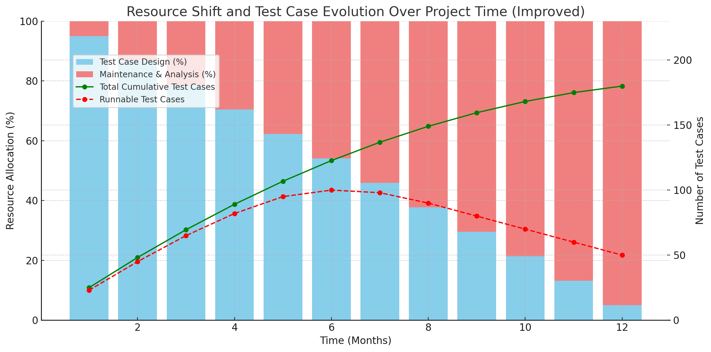

## Warum dieser ganze Aufwand?

Testautomatisierung klingt erstmal cool: Einmal klicken, Kaffee holen, und der Rechner prüft brav alles durch.  
In der Praxis sieht’s aber oft anders aus: Fragile Tests, unverständliche Skripte und ständiges Nachbessern. Warum ist das so?

**Meine persönliche Antwort begann 2003.**  
Damals malte ich einen einfachen Graphen aufs Flipchart:  
Am Anfang hat man fast die komplette Kapazität für das Erstellen neuer Tests – doch mit der Zeit frisst die Wartung immer mehr davon auf.  
Irgendwann bleibt kaum noch Energie für neue Testfälle.  
Und was noch schlimmer ist: Selbst die bestehenden Tests laufen immer seltener fehlerfrei durch.

Das war der Moment, in dem mir klar wurde:  
**So kann das nicht bleiben.**  
Und weil kaum jemand in der Branche sich ernsthaft für Testautomatisierung interessierte, fing ich an, selbst nach Lösungen zu suchen.

> Das war übrigens die Zeit, in der "Testautomatisierung" noch als exotisches Hobby galt – und meine Sorgen bestenfalls für ein höfliches Nicken sorgten.

Seitdem habe ich Methoden, Prinzipien und Werkzeuge gesammelt – viele verworfen, einige weiterentwickelt – mit dem Ziel, **Testautomatisierung nachhaltig wartbar zu machen**.

---
## Testautomatisierung: Wenn Wartung alles auffrisst

*Abb. 1: Qualitative Darstellung des Ressourcenverbrauchs in der Testautomatisierung über die Zeit.*

Dieses Diagramm stammt aus dem Jahr 2003 und zeigt ein wiederkehrendes Problem:  
Anfangs wird fast die gesamte Kapazität für die **Erstellung neuer Tests** (blau) verwendet.  
Doch mit der Zeit steigt der **Wartungsaufwand** (rot), bis schließlich kaum noch neue Tests entstehen.  

Der grüne Graph zeigt die **Gesamtzahl aller Testfälle**, die – durch fehlende Kapazität – immer langsamer wächst.  
Besonders kritisch: Die Zahl der **tatsächlich lauffähigen Tests** (dargestellt als Punkte) sinkt mit der Zeit sogar – obwohl neue Tests hinzukommen.  
Ein Zeichen dafür, dass Wartung, Stabilität und Wiederverwendbarkeit zu wenig berücksichtigt wurden.

👉 Dieses Problem war für mich der Auslöser, nach Prinzipien zu suchen, die den Aufwand **dauerhaft reduzieren** – viele davon findest du in diesem Buch.

---
### Was erwartet dich in diesem Abschnitt?

Bevor wir zu den konkreten Lösungen kommen, schauen wir uns erstmal die typischen Ursachen für den Aufwand an:

- Warum Tests oft nicht wiederverwendbar sind.
    
- Wieso kleine Änderungen an der Software plötzlich große Testprobleme machen.
    
- Warum gute Absichten (und Copy & Paste) selten zu wartbaren Tests führen.
    
- Und warum Entwickler manchmal auf Unit-Tests verzichten – obwohl sie es besser wissen.
    

Ziel ist es, ein Gefühl für typische Stolperfallen zu bekommen.  
Denn wer die Probleme verstanden hat, kann später gezielt zu den passenden Lösungen greifen.

---

➡️ In den nächsten Kapiteln findest du dann genau diese Lösungen: **Prinzipien, Konzepte und konkrete Beispiele**, wie du den Testaufwand **radikal senken** kannst – und dabei sogar stabilere Tests bekommst.

---
