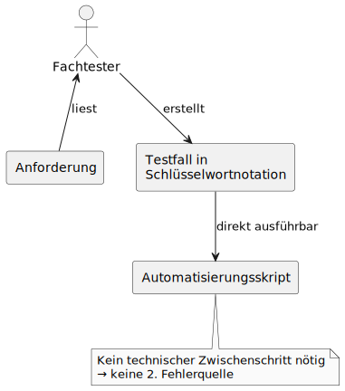

## Wie Schlüsselwörter die Brücke zwischen Fachtest und Automatisierung schlagen

Die beste Möglichkeit, Aufwand zu vermeiden?  
**Gar nichts machen müssen.**

Das klingt erstmal nach Faulheit – ist aber in Wahrheit **maximale Effizienz**:  
Denn jede Tätigkeit, die **nicht** anfällt, spart nicht nur Zeit, sondern auch Komplexität und Fehlerquellen.

---

## Ein klassisches Beispiel: Die Übersetzung in Skriptsprache

In vielen Projekten müssen Testfälle – meist von Fachtestern geschrieben – von anderen Personen in Skriptcode „übersetzt“ werden.  
Das kostet Zeit, erfordert viel Abstimmung und ist anfällig für Fehler.

Aber: **Braucht man diese Übersetzung überhaupt?**

---

## Schlüsselwortbasiertes Testen: Schreiben wie ein Mensch, ausführen wie ein Automat

Wenn Testfälle mit **Schlüsselwörtern** (Keywords) beschrieben werden, passiert plötzlich etwas Magisches:

- Fachtester schreiben ihre Testfälle **lesbar und verständlich** – fast wie in Prosa.
- Die Beschreibung ist dabei **strukturiert und formal genug**, dass sie **direkt automatisiert** ausgeführt werden kann.
- Eine zusätzliche Übersetzung durch ein separates Team entfällt komplett.

Der Ablauf der Testfallerstellung mit Schlüsselwörtern, dabei wird die Automatisierung einem geschenkt:



---

## Einmal automatisiert – unendlich oft genutzt

Die Grundidee:  
Ein Testfall besteht aus einer Abfolge von Schlüsselwörtern wie `GibEin`, `PrüfeWert` oder `Klicke`.

Diese Schlüsselwörter werden **einmalig** durch ein Automatisierungsteam implementiert – und stehen dann **beliebig oft** zur Verfügung.

> 👉 Ein Testfall ist dann nur noch eine **Reihung von Bausteinen**, die bereits funktionieren.

Und genau das ist die Essenz des DRY-Prinzips:  
**Einmal machen – überall wiederverwenden.**

## Beispiel für einen schlüsselwortbasierten Testfall


```robot
*** Settings ***
Documentation     Keyword-driven test with abstract locators. Click is generic; Menu has special handling.

*** Test Cases ***
Create New Expense Report
    Open Application      Travel Expenses
    Select Menu           New Expense Report
    Set Value             Travel Date        2025-05-12
    Set Value             Destination        Berlin
    Click                 Save
    Verify Value          Status Message     Expense report saved
```

Jeder Schritt nutzt ein **abstraktes Schlüsselwort** (`Set Value`, `Click`, `Verify Value`, ggf.  `Select Menu`) und einen **abstrakten Lokator** wie `"Zielort"` – also einen funktionalen Namen, der vom Testautor verwendet wird.

> Zur Laufzeit werden diese abstrakten Lokatoren von der Schlüsselwortbibliothek in **konkrete Lokatoren** (z. B. XPath oder CSS-Selektoren) übersetzt – der Fachtester muss sich darum nicht kümmern. 
> Siehe hierzu: [Abstrakte_und_Konkrete_Lokatoren](../04_testfallstruktur-und-abstraktion/Abstrakte_und_Konkrete_Lokatoren.md)

Das Ergebnis:  
Der Test ist **leicht verständlich, wiederverwendbar und wartungsarm**.

## Fazit

Reduktion auf Null heißt:  
**Nicht optimieren, sondern eliminieren.**

Wenn etwas nicht nötig ist – z. B. das manuelle Übersetzen von Testfällen – dann sollte es auch nicht stattfinden.

Schlüsselwortbasierte Tests sind dabei ein mächtiges Werkzeug, um unnötige Arbeit von vornherein zu verhindern – und machen gleichzeitig das Testdesign klarer und verständlicher.

