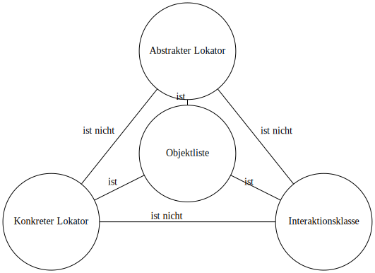

#status/entwurf

---
title: DRY-Prinzip – Wiederholung vermeiden, Wartung erleichtern
description: Warum das DRY-Prinzip für nachhaltige Testautomatisierung unverzichtbar ist – und wie man es konkret umsetzt.
tags:
  - dry
  - prinzipien
  - wartbarkeit
  - testautomatisierung
  - technikensammlung
status: fertig
type: kapitel
sidebar_position: 3
editors:
  - zoltan
created: 2025-07-13
updated: 2025-09-09
rolle: Kapitelübersicht
---

## Vermeidung von Aufwänden bei den Objekt-Erkennungseigenschaften

Testautomatisierungswerkzeuge bieten unter verschiedenen Bezeichnungen wie 
* Objekt-Repository 
* GUI-Frame
* GUI-Map 
* Test-Frame  

jeweils eine eigene Lösung für das gleiche Problem: eine **Struktur zur zentralen Verwaltung der Objekterkennungseigenschaften**.  
Im Kern ist das eine Liste, in der [[Abstrakte und Konkrete Lokatoren]] verwaltet werden.  

Fachlicher Bezeichner, Lokator und GUI-Element verwenden einheitlich das gleiche Attribut.  
Vorteile:  
* Lokatoren können vorab erstellt werden  
* Lokatoren sind mit einem Attribut leicht erstellbar  
* Lokatoren sind in der Ausführung schneller  
* Im Fehlerfall ist die Identifizierung der Objekte einfach, da alle Komponenten einheitlich benannt sind  
* Kommunikation zwischen Tester, Entwickler und Anforderungsanalytiker wird vereinfacht  

---

## Die „Heilige Dreifaltigkeit“ der Objektlisten

Wer in der Theologie aufgepasst hat, kennt die Formel: **Vater, Sohn und Heiliger Geist** sind drei Personen – und doch ein einziger Gott.  
Keine Sorge: Wir steigen hier nicht in eine Glaubensdebatte ein. Aber die Struktur eignet sich hervorragend als Analogie, um die Rollen in unseren Objektlisten zu erklären.

---

### Drei – und doch eins

- **Der Vater → Abstrakter Lokator**  
  Der Ursprung und die Idee: ein funktionaler Name wie `LoginButton` oder `UserNameField`.  
  Noch völlig losgelöst von Technik, einfach nur die Bedeutung im Testfall.

- **Der Sohn → Konkreter Lokator**  
  Das Abstrakte wird „Fleisch“: aus dem Namen wird ein XPath, ein CSS-Selektor oder eine TestID.  
  Erst dadurch kann die Maschine die GUI-Elemente tatsächlich finden.

- **Der Heilige Geist → Interaktionsklasse**  
  Unsichtbar, aber spürbar: die Aktionen (`Click()`, `SetValue()`, `VerifyValue()`) machen den Testfall lebendig.  
  Ohne den Geist gäbe es nur tote Namen und Koordinaten – mit ihm wird wirklich etwas bewegt.

---

### Das Ganze ist mehr als die Summe der Teile

- Ein **abstrakter Lokator** allein ist nutzlos: er weiß, *was* etwas bedeutet, aber nicht, *wo* es ist.  
- Ein **konkreter Lokator** allein ist brüchig: er kennt das *Wo*, aber ohne Bedeutung.  
- Eine **Interaktionsklasse** allein klickt ins Leere, wenn sie nicht weiß, *auf was*.  

👉 Erst zusammen ergeben die drei Rollen eine funktionsfähige Einheit – so wie die Dreifaltigkeit in der Theologie eine Einheit bildet.  

---

### Diagramm

Zur besseren Veranschaulichung nutzen wir das klassische „Trinitätsdreieck“ – angepasst an unsere Objektlisten:

- **Objektliste** = das Zentrum, das alle Rollen vereint.  
- Von der Mitte zu den Ecken: **ist**  
- Zwischen den Ecken: **ist nicht**  

So wird klar: jede Rolle ist **eigenständig und darf nicht verwechselt werden**, aber sie gehören **unumstößlich zusammen**.

---

### Exkurs: Zombie-Automatisierung

⚠️ **Achtung: falsches Leben!**  

Viele Teams konzentrieren sich nur auf das Sichtbare – Hauptsache, es klickt und tippt!  
Aber wenn nur die Interaktionsklasse im Fokus steht, entsteht eine **Zombie-Automatisierung**:  
- Sie sieht lebendig aus, weil Buttons bewegt werden und Screenshots entstehen.  
- Doch innerlich stirbt das Projekt, weil Abstrakt und Konkret fehlen.  

**Echte Lebendigkeit** in der Automatisierung entsteht nur, wenn **abstrakte Lokatoren, konkrete Lokatoren und Interaktionen** zusammenspielen.  
Alles andere ist ein Projekt auf dem Weg ins Grab.

---

### Seitenhieb: POM – das scheinheilige Modell

Das klassische **Page Object Model (POM)** wirkt auf den ersten Blick ordentlich:  
Alle Elemente einer Seite liegen schön gesammelt in einer Klasse.  
Doch genau hier beginnt das Problem:

- **Alles in einem Topf:** Lokatoren, Testlogik und Interaktionen werden vermischt.  
- **Kein klares Rollenverständnis:** Abstrakt, konkret und interaktiv verschwimmen zu einer undurchsichtigen Suppe.  
- **Hohe Kopplung:** Änderungen in der GUI ziehen weite Kreise, weil alles aneinanderhängt.  

👉 Im Ergebnis passiert das Gegenteil von dem, was wir wollen:  
- Tests werden **nicht wartbarer**, sondern fragiler.  
- Wiederverwendung wird **nicht gefördert**, sondern blockiert.  
- DRY wird **nicht eingehalten**, sondern verletzt.

🙏 **POM – das scheinheilige Modell**  
Das Page Object Model tritt gerne auf wie eine religiöse Wahrheit: *„So muss man Automatisierung bauen.“*  
Doch wer genauer hinsieht, merkt schnell: Das Modell ist **scheinheilig**.  
Es predigt Trennung, liefert aber Vermischung.  
Es verspricht Wartbarkeit, erzeugt aber Kopplung.  
Es wirkt ordentlich, tötet aber auf Dauer die Testautomatisierung.  

Die **wahre Dreifaltigkeit** unserer Objektlisten zeigt, wie es richtig geht:  
**Abstrakt, konkret und interaktiv – sauber getrennt, aber untrennbar vereint.**

---

> 💡 **Merksatz:**  
> Abstrakt, konkret und interaktiv – drei verschiedene Rollen.  
> Zusammen bilden sie die „lebendige Einheit“ unserer Testautomatisierung.
