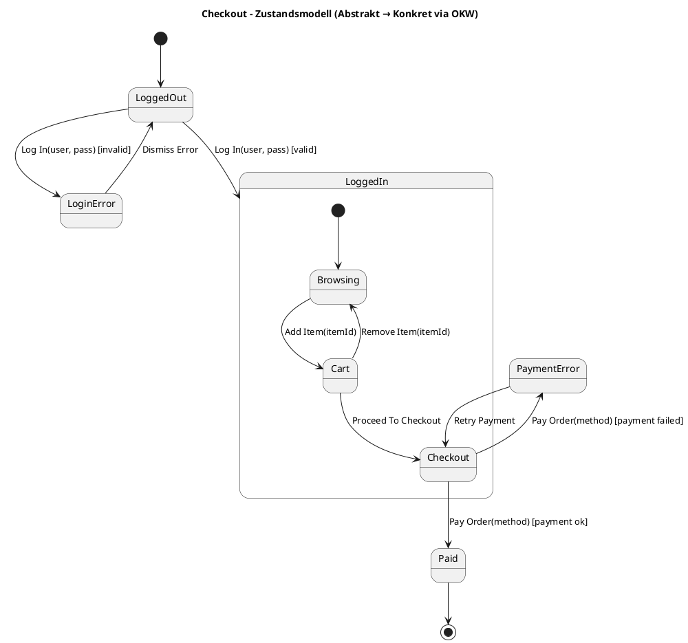

# Modelle & MBT

Eine weitere DRY-Methode ist der Einsatz von **Modellen** (Model-Based Testing).  
Statt jeden Testfall einzeln zu schreiben, wird das **Systemverhalten abstrakt beschrieben** – z. B. durch ein Zustandsmodell.  
Aus dem Modell lassen sich **Testfälle automatisch generieren**.

---

## Beispiel: Checkout-Zustandsmodell

> Ablage: `inhalt/assets/diagrams/dry-modelle/checkout-flow.puml`

---

## Vorteile

- **Redundanzarm** – Szenarien sind nicht mehrfach niedergeschrieben.
- **Systematisch** – auch „unpopuläre“ Pfade (Fehlerfälle) werden generiert.
- **Erweiterbar** – neue Zustände/Übergänge werden einmalig im Modell ergänzt.

---

## Fallstricke

- **Over-Engineering** – für einfache Systeme lohnt MBT nicht immer.
- **Generierungskomplexität** – zu viele Zustände/Übergänge → Testexplosion.
- **Pfad-Auswahl** – man muss bewusst entscheiden, welche Pfade getestet werden sollen.