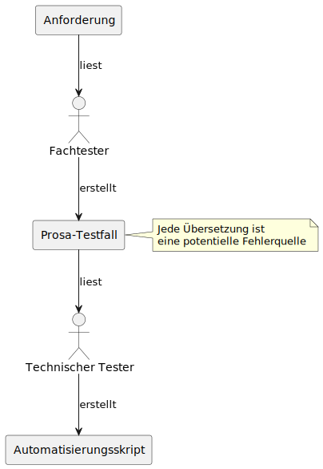

## Übliche Vorgehensweise: Zwei Übersetzungen pro Testfall

In vielen Projekten läuft die Testautomatisierung ungefähr so ab:

1. Ein **Fachtester** erstellt einen Testfall in Prosa.
2. Ein **technischer Tester** übersetzt diesen in die Skriptsprache des Automatisierungswerkzeugs.

Klingt erstmal logisch – ist aber mit unnötigem Aufwand und Risiko verbunden.

---

## Zwei Übersetzungen, zwei Problemquellen

Die Umsetzung einer fachlichen Anforderung in ein automatisiertes Testskript umfasst typischerweise **zwei separate Übersetzungsschritte**:

1. **Anforderung → Prosa-Testfallbeschreibung**  
2. **Prosa-Testfallbeschreibung → Automatisierungsskript**

In der Praxis führt das oft zu folgenden Problemen:

- Die Prosa-Testfälle sind **zu ungenau**, z. B. _„Man wählt eine geeignete Person aus.“_
- Es fehlen **konkrete Testdaten** – der Testfall ist rein **abstrakt**.
- Die **Startbedingungen** sind unklar: Welche Daten oder Zustände werden in der Testumgebung vorausgesetzt?

**Jede dieser Übersetzungen ist eine Interpretation – und jede Interpretation ist eine potenzielle Fehlerquelle.**  
Solche Lücken erzeugen Nachfragen, Missverständnisse – oder führen dazu, dass der Testfall gar nicht umgesetzt wird.

## Zwei Übersetzungen = doppelte Fehlerquelle

Ein klassisches Problem in der Testautomatisierung:  
**Ein Testfall wird nicht einmal, sondern zweimal interpretiert – und damit potenziell verfälscht.**

Der Ablauf sieht in vielen Projekten so aus:

*Jeder Übersetzungsschritt ist eine potenzielle Fehlerquelle.*

Jede Rolle bringt ihre Sichtweise und ihr Verständnis ein – was grundsätzlich gut ist.  
Aber bei mangelnder Struktur oder unklaren Begriffen entstehen **Interpretationsspielräume**, die sich in Bugs oder instabilen Tests niederschlagen.

Die Lösung?  
Ein Notationssystem, das beide Welten zusammenbringt – z. B. durch **abstrakte Lokatoren und Schlüsselwörter**.

---

## Was wäre, wenn diese Übersetzung entfällt?

Zwei Übersetzungen bedeuten doppelten Aufwand – und doppeltes Risiko für Missverständnisse.  
Aber was, wenn man den zweiten Schritt einfach **weglassen** könnte?

Im Kapitel 👉 [Keine Übersetzung nötig](Keine%20Übersetzung%20nötig.md) zeigen wir, wie sich dieser Schritt komplett eliminieren lässt –  
**durch schlüsselwortbasierte Testfallbeschreibung**, die direkt automatisierbar ist.
